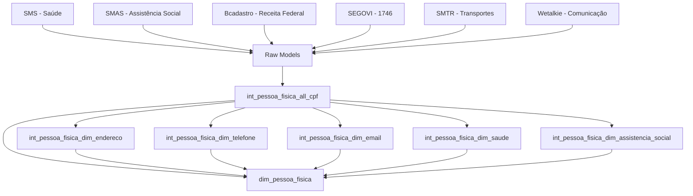

# MAP.md - Mapa de Dados do CRM Registry

Este documento mapeia como os modelos de dados e conexões funcionam no projeto, permitindo que novos desenvolvedores entendam rapidamente a arquitetura.

## 🏗️ Arquitetura Geral

O projeto segue uma arquitetura medallion com 4 camadas principais:

```
Sources (BigQuery) → Raw → Intermediate → Core/Marts
```

### 📊 Visão Geral do Fluxo



## 🔄 Camadas Detalhadas

### 1. **Sources (Fontes de Dados)**

| Sistema | Database | Schema | Descrição |
|---------|----------|---------|-----------|
| **rj-sms** | `rj-sms` | `saude_historico_clinico` | Dados de saúde municipal |
| **rj-smas** | `rj-smas` | `app_identidade_unica` | Assistência social (CadÚnico) |
| **bcadastro** | `rj-iplanrio` | `brutos_bcadastro` | Cadastro da Receita Federal |
| **rj-segovi** | `rj-segovi` | - | Chamados 1746 |
| **rj-smtr** | `rj-smtr` | - | Dados de transporte |
| **wetalkie** | - | `brutos_wetalkie_staging` | Comunicação/WhatsApp |

### 2. **Raw Layer (models/raw/)**

Modelos que referenciam diretamente as sources usando `{{ source() }}`:
- Mantêm estrutura original dos dados
- Aplicam limpezas básicas
- Materialização: **table**

### 3. **Intermediate Layer (models/intermediate/)**

#### 🔑 **Modelo Central: `int_pessoa_fisica_all_cpf`**

**Localização**: `models/intermediate/core/int_pessoa_fisica_all_cpf.sql`

Este é o **modelo mais importante** - consolida todos os CPFs de diferentes sistemas:

```sql
-- Fontes de CPF por sistema:
saude     ← rj-sms.paciente
cadunico  ← rj-smas.cadastros  
chamados  ← rj-segovi.1746_chamado_cpf
transporte ← rj-smtr.transacao_cpf
bcadastro ← bcadastro.cpf (principal)
```

**Saída**: Lista única de CPFs com origem rastreada

#### 📋 **Modelos Dimensionais**

Todos dependem de `int_pessoa_fisica_all_cpf` e seguem o padrão:

| Modelo | Responsabilidade | Fontes Principais |
|--------|------------------|-------------------|
| `int_pessoa_fisica_dim_endereco` | Consolida endereços | SMS, SMAS, Bcadastro + Geolocalização |
| `int_pessoa_fisica_dim_telefone` | Consolida telefones | SMS, SMAS, Bcadastro |
| `int_pessoa_fisica_dim_email` | Consolida emails | Bcadastro |
| `int_pessoa_fisica_dim_saude` | Dados de saúde | SMS (paciente) |
| `int_pessoa_fisica_dim_assistencia_social` | CadÚnico | SMAS (cadastros) |
| `int_pessoa_fisica_dim_ocupacao` | Ocupação/trabalho | Ergon (funcionários) |

**Materialização**: **ephemeral** (exceto em dev = table)

### 4. **Core Layer (models/core/)**

#### 👤 **`dim_pessoa_fisica` - Modelo Principal**

**Localização**: `models/core/dimensions/dim_pessoa_fisica.sql`

**Lógica de Construção**:
1. **Base**: Lista única de CPFs de `int_pessoa_fisica_all_cpf`
2. **Joins**: LEFT JOIN com todas as dimensões intermediárias
3. **Fontes Diretas**: Bcadastro (dados básicos), SMS (saúde), SMAS (social)

**Estrutura**:
```sql
SELECT 
    cpf,                    -- Chave primária
    nome, nome_social,      -- Identificação (Bcadastro)
    nascimento,             -- Struct com data/local
    endereco,               -- Struct com endereço principal + alternativo
    telefone,               -- Struct com telefone principal + alternativo  
    email,                  -- Struct com email principal + alternativo
    saude,                  -- Dados SMS
    assistencia_social,     -- Dados SMAS
    ocupacao                -- Dados Ergon
FROM all_cpfs + dimensões
```

**⚠️ Problema Atual**: CPFs duplicados (390 casos) devido a modelos intermediários retornando múltiplas linhas por CPF.

## 🔍 Dependências Críticas

### **Fluxo de Dependências**

```
int_pessoa_fisica_all_cpf (base)
    ↓
int_pessoa_fisica_dim_* (dimensões)
    ↓  
dim_pessoa_fisica (final)
```

### **Pontos de Atenção**

1. **`int_pessoa_fisica_all_cpf`**: Se este modelo falhar, toda a pipeline para
2. **Geolocalização**: `dim_endereco_geolocalizado` é necessário para endereços
3. **Particionamento**: Todos os modelos usam `cpf_particao` para performance

## 📈 Outros Modelos

### **WhatsApp/Comunicação**
- `int_whatsapp_fluxo_atendimento` ← Wetalkie
- `fct_whatsapp_sessao` ← Fatos de sessão
- `dim_whatsapp_*` ← Dimensões de mensagem

### **Marts**
- `mart_mocked_data_dim_pessoa_fisica` ← Dados fictícios para testes

## 🛠️ Como Debugar Problemas

### **1. CPFs Duplicados**
```sql
-- Verificar qual dimensão está duplicando
SELECT cpf, COUNT(*) as qty
FROM int_pessoa_fisica_dim_endereco  -- testar cada dimensão
GROUP BY cpf 
HAVING COUNT(*) > 1
```

### **2. Dependências Quebradas**
```bash
# Compilar para ver dependências
dbt compile --select dim_pessoa_fisica

# Rodar dependências primeiro
dbt run --select +dim_pessoa_fisica --exclude dim_pessoa_fisica
```

### **3. Dados Vazios**
```sql
-- Verificar se sources têm dados
SELECT COUNT(*) FROM {{ source("rj-sms", "paciente") }}
```

## 🎯 Pontos-Chave para Novos Desenvolvedores

1. **Tudo começa com CPF**: `int_pessoa_fisica_all_cpf` é a fundação
2. **Materialização importa**: Intermediate = ephemeral, Core = table
3. **Particionamento**: Todos os joins usam `cpf_particao` para performance
4. **Unicidade**: Cada modelo intermediário deve retornar 1 linha por CPF
5. **Sources vs Refs**: Use `source()` para dados externos, `ref()` para modelos dbt

## 📋 Lista de Verificação para Mudanças

- [ ] Modelo mantém unicidade por CPF?
- [ ] Usa `cpf_particao` para joins?
- [ ] Segue convenções de nomenclatura?
- [ ] Tem testes de qualidade?
- [ ] Documentação atualizada no .yml?

---

**💡 Dica**: Sempre rode `dbt test` após mudanças para verificar integridade dos dados!